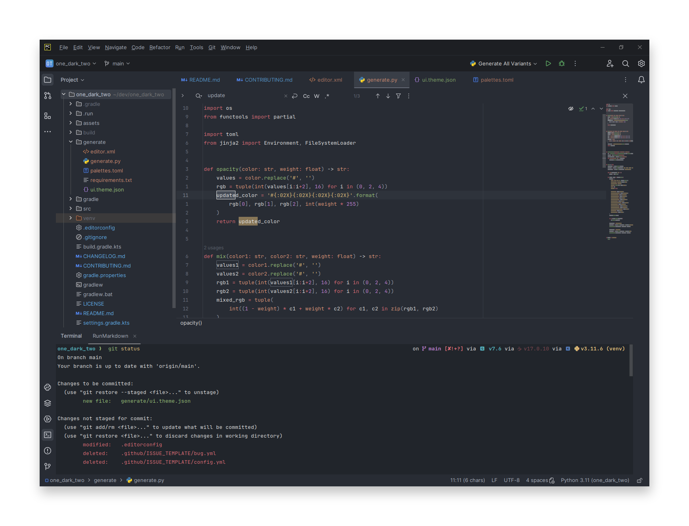

<!-- Plugin description -->
<h3 align="center">
	
   
   
	One Dark Two for <a href="https://www.jetbrains.com/">JetBrains IDEs</a>
   
</h3>
<!-- Plugin description end -->

  

**One Dark Two** is my interpretation of the One Dark theme with more contrast.
This repository is based on the code by:

* [catpuccin/jetbrains](https://github.com/catppuccin/jetbrains)
* [one-dark/jetbrains-one-dark-theme](https://github.com/one-dark/jetbrains-one-dark-theme)
* [subtheme-dev/atom-one](https://github.com/subtheme-dev/atom-one)

## Installation

### Plugin Marketplace

1. Head to the [Plugin Marketplace](https://plugins.jetbrains.com) (<kbd>Settings</kbd> → <kbd>Plugins</kbd> → <kbd>
   Marketplace</kbd>)
2. Search for **"One Dark Two"**
3. Install Plugin

### Manual

Download the [latest release](https://github.com/beatreichenbach/one_dark_two/releases/latest) and import it by heading to <kbd>
Settings</kbd> → <kbd>Plugins</kbd> → ⚙️ → <kbd>Install plugin from disk...</kbd>

## Usage

There are 2 variants for you to choose from: **Fresh** and **Classic**.

### User Interface

1. Head to <kbd>Settings</kbd> → <kbd>Appearance & Behaviour</kbd> → <kbd>Appearance</kbd>
2. Pick your favourite flavour
3. **(Optional)** Restart your IDE

### Code Editor

1. Head to <kbd>Settings</kbd> → <kbd>Editor</kbd> → <kbd>Color Scheme</kbd>
2. Pick your favourite flavour
3. **(Optional)** Restart your IDE

## Contributing

See [CONTRIBUTING.md](CONTRIBUTING.md)
